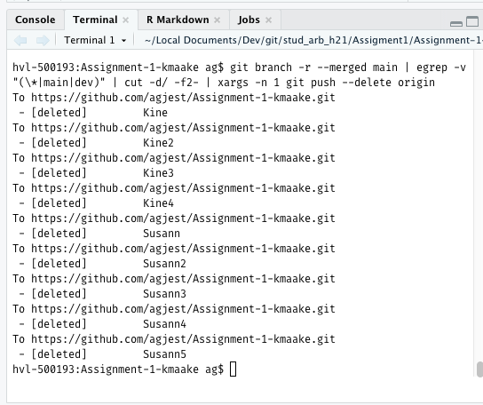

-   Imponerende git historie! Godt dere kom helskinnet fra det ;-)

{width="564"}

-   Dokumentet konverteres til de tre formatene uten problem.
    Bra!

-   Dere valgte tre artikler å skrive utfra istedenfor en mer tradisjonell litteraturgjennomgang.
    Fungerte kanskje like så godt

-   Se hvordan jeg har brukt *inline citation* (f.eks bruk av \@peng2011 ).
    Gjør at en kan skrive mer direkte.

-   Ser at dere har fått kjempe litt med git/github.
    Håper det ikke har tatt helt motet fra dere.
    Trøsten får være at dere i løpet av få uker vil ha taket på det.

-   Har fikset litt på overskriftene ved å benytte de ulike nivåen for «heading».

-   Etter dere har «merged» min grein med main bør dere kanskje slette litt grener for å rydde opp.
    Grener på remote kan slettes vha.
    følgende kommando i Terminal:

`git branch -r --merged main | egrep -v "(\*|main|dev)" | cut -d/ -f2- | xargs -n 1 git push --delete origin`

Dette burde gi noe liknende dette

Da skulle alle greiner som er «merged» med main bli slettet.
