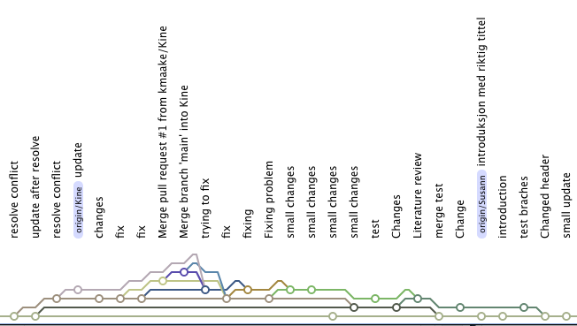

-   Imponerende git historie! Godt dere kom helskinnet fra det ;-)

{width="564"}

-   Dokumentet konverteres til de tre formatene uten problem. Bra!
-   Dere valgte tre artikler å skrive utfra istedenfor en mer tradisjonell litteraturgjennomgang. Fungerte kanskje like så godt
-   Se hvordan jeg har brukt *inline citation* (f.eks bruk av \@peng2011 ). Gjør at en kan skrive mer direkte.
-   Ser at dere har fått kjempe litt med git/github. Håper det ikke har tatt helt motet fra dere. Trøsten får være at dere i løpet av få uker vil ha taket på det.
-   Har fikset litt på overskriftene ved å benytte de ulike nivåen for «heading».
